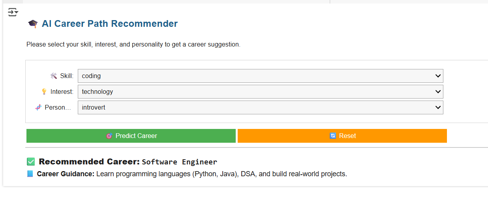

# 🎓 AI Career Path Recommender

Welcome to the **AI Career Path Recommender** – an interactive, machine learning–based application that helps users discover the most suitable career paths based on their **skills**, **interests**, and **personality** traits.

This project was developed as part of an AI internship to demonstrate how intelligent systems can offer personalized guidance in education and career planning.

---

## 📌 Table of Contents

- [🧠 About the Project](#-about-the-project)
- [🚀 Features](#-features)
- [📊 Demo](#-demo)
- [🛠️ Tech Stack](#-tech-stack)
- [📁 Dataset](#-dataset)
- [💡 How It Works](#-how-it-works)
- [▶️ Running the Project](#️-running-the-project)
- [📘 Career Guidance Sample](#-career-guidance-sample)
- [🔮 Future Scope](#-future-scope)
- [👩‍💻 Author](#-author)
- [📜 License](#-license)

---

## 🧠 About the Project

The **AI Career Path Recommender** uses a simple yet powerful Decision Tree Classifier to analyze user inputs and predict a matching career field. The system provides instant career predictions along with practical guidance to start pursuing that path.

---

## 🚀 Features

- ✅ Predicts suitable careers using AI/ML
- 📘 Displays career-specific guidance and learning paths
- 🧩 User-friendly dropdown-based interface using IPyWidgets
- 🔄 Prevents result duplication using `clear_output`
- 📁 Works directly in Google Colab (no local setup needed)
- 🌐 Easily extendable for advanced personality and psychometric testing

---

## 📊 Demo



*Prediction result with career suggestion and guidance.*

---

## 🛠️ Tech Stack

| Component       | Technology                      |
|----------------|----------------------------------|
| Frontend       | IPyWidgets, Markdown, HTML (Colab) |
| ML Model       | Decision Tree Classifier         |
| Libraries      | Pandas, Scikit-learn, IPython    |
| Platform       | Google Colab                     |

---

## 📁 Dataset

Ensure your dataset is named:


### 🧾 Required Columns:

| skill          | interest       | personality     | career          |
|----------------|----------------|------------------|------------------|
| Problem Solving | Technology     | Analytical       | Data Scientist   |
| Creativity      | Design         | Extrovert        | Graphic Designer |

📌 **Note:** Remove null values before training.

---

## 💡 How It Works

1. User selects **Skill**, **Interest**, and **Personality** from dropdowns.
2. Inputs are encoded using `LabelEncoder()`.
3. The Decision Tree model predicts a career.
4. Matching **career guidance** is shown below the result.

---

## ▶️ Running the Project

### ✅ Google Colab Steps

1. Open Google Colab.
2. Upload:
   - `career_data_large.csv`
   - Your notebook file (`.ipynb`)
3. Mount your Google Drive if the dataset is stored there.
4. Run the notebook sequentially.
5. Select options in the dropdown and click **Predict Career**.

---

## 📘 Career Guidance Sample

```text
Career: Data Scientist

Guidance:
Start with Python, statistics, and machine learning.
Learn to use tools like Pandas, NumPy, and Scikit-learn.
Practice with real datasets and build a portfolio on GitHub or Kaggle.
